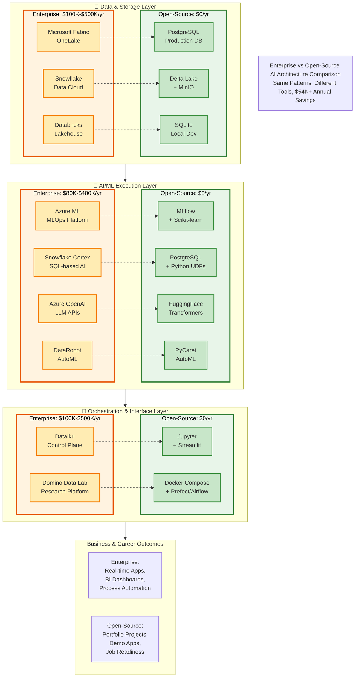

# Side-by-Side Architecture Comparison

This diagram shows **Enterprise vs Open-Source** AI architectures in a direct visual comparison.

## 💰 Cost Comparison Summary

| Layer | Enterprise Annual Cost | Open-Source Annual Cost | Savings |
|-------|----------------------|------------------------|---------|
| **Data & Storage** | $100K - $500K+ | **$0** | $100K - $500K+ |
| **AI/ML Execution** | $80K - $400K+ | **$0** | $80K - $400K+ |
| **Orchestration** | $100K - $500K+ | **$0** | $100K - $500K+ |
| **Monitoring & Ops** | $20K - $100K+ | **$0** | $20K - $100K+ |
| **TOTAL** | **$300K - $1.5M+** | **$0** | **$300K - $1.5M+** |

## 🔄 Direct Tool Mapping

| Enterprise Tool | Open-Source Alternative | What You Learn |
|----------------|------------------------|----------------|
| **Microsoft Fabric OneLake** | PostgreSQL + Delta Lake | Unified data storage, data lake patterns |
| **Snowflake Data Cloud** | PostgreSQL + dbt | Analytical queries, data warehouse design |
| **Databricks Lakehouse** | Delta Lake + Spark | Lakehouse architecture, data versioning |
| **Azure ML** | MLflow + Scikit-learn | Complete MLOps lifecycle, experiment tracking |
| **Snowflake Cortex AI** | PostgreSQL + Python UDFs | SQL-based AI, in-database ML |
| **Azure OpenAI** | HuggingFace Transformers | LLM integration, prompt engineering |
| **DataRobot** | PyCaret | AutoML workflows, model comparison |
| **Dataiku** | Jupyter + Streamlit + Docker | Collaborative workflows, visual interfaces |
| **Domino Data Lab** | JupyterHub + MLflow | Research platform, reproducibility |

## 🎯 Key Insights

### 1. **Same Architectural Patterns**
Both stacks follow identical architectural layers:
- **Data Layer**: Centralized storage for analytics
- **AI/ML Layer**: Model training, experimentation, deployment
- **Orchestration Layer**: Workflow management and collaboration

### 2. **Transferable Skills**
Learning the open-source stack teaches you:
- MLOps best practices that apply to any platform
- SQL patterns that work across all data warehouses
- REST API design principles (universal)
- Docker/containerization (industry standard)
- Git version control (everywhere)

### 3. **Interview Value**
When discussing these projects:

> "While I used open-source tools for learning, I specifically designed my architecture to mirror enterprise patterns. For example, my MLflow implementation demonstrates the same experiment tracking, model registry, and deployment workflows you'd find in Azure ML or SageMaker."

> "I chose PostgreSQL with Python UDFs to simulate Snowflake Cortex's SQL-based AI approach. This taught me the value of keeping computation close to data—a principle that applies whether you're using Snowflake, BigQuery, or Redshift."

### 4. **When to Choose Each Stack**

**Enterprise Stack** is best for:
- Petabyte-scale data processing
- Strict compliance requirements (GDPR, HIPAA, SOC2)
- 100+ person data teams
- Mission-critical production systems
- Need for enterprise SLAs and support

**Open-Source Stack** is best for:
- Learning MLOps fundamentals
- Building portfolio projects
- Prototyping and experimentation
- Small to medium teams
- Cost-conscious startups
- Educational purposes

## 📊 Live Portfolio Projects

All three projects built with the open-source stack are deployed and accessible:

### Project 1: Customer Analytics Dashboard
- **Enterprise Equivalent:** Snowflake Cortex AI
- **Tech:** Streamlit, SQLite, TextBlob, Prophet
- **Live Demo:** https://enterprise-ai-workflows-d3ds3rasntycg5bwaqru5a.streamlit.app

### Project 2: MLOps Pipeline
- **Enterprise Equivalent:** Azure ML + Dataiku
- **Tech:** MLflow, FastAPI, Docker, PostgreSQL
- **Live Demos:**
  - MLflow UI: https://zhangju2023-mlops-pipeline-demo.hf.space/mlflow/
  - API Docs: https://zhangju2023-mlops-pipeline-demo.hf.space/api/docs
  - Health Check: https://zhangju2023-mlops-pipeline-demo.hf.space/api/health
  - Example: https://zhangju2023-mlops-pipeline-demo.hf.space/api/predict/example

### Project 3: Document Q&A (RAG)
- **Enterprise Equivalent:** Azure OpenAI RAG
- **Tech:** ChromaDB, SentenceTransformers, Gradio
- **Live Demo:** https://huggingface.co/spaces/zhangju2023/document-qa-rag

## 💡 The Bottom Line

> **Enterprise tools provide convenience and scale at a cost. Open-source tools provide understanding and control for free. Both teach the same fundamental patterns.**

The goal isn't to replace enterprise tools—it's to understand them deeply enough that you can work with any platform.

---

## 📚 Related Documentation

- [Enterprise Architecture Details](./ARCHITECTURE-ENTERPRISE.md)
- [Open-Source Architecture Details](./ARCHITECTURE-OPENSOURCE.md)
- [LinkedIn Post](./LINKEDIN_POST.md)
- [GitHub Repository](https://github.com/justin-mbca/enterprise-ai-workflows)

---

**Total Enterprise Cost:** $300K - $1.5M+/year  
**Total Open-Source Cost:** $0/year  
**Annual Savings:** $300K - $1.5M+  
**Learning Value:** Priceless  
**Interview Impact:** Significant

