# Enterprise AI Architecture - Original Tools

This diagram shows the **enterprise-grade stack** used by Fortune 500 companies.

```mermaid
graph TD
    %% ========== TITLE & CONTEXT ==========
    title[Enterprise AI Architecture<br/>How Modern Companies Orchestrate Their AI Stack]
    
    %% ========== BUSINESS DRIVERS ==========
    B1[Business Problems<br/>Fraud Detection, Customer Insights, Process Automation]
    B2[Data Challenges<br/>Scale, Governance, Multiple Sources]
    B3[Team Diversity<br/>Data Scientists, Analysts, Engineers]
    
    B1 --> SP{Strategic Platform Choices}
    B2 --> SP
    B3 --> SP
    
    %% ========== CORE ARCHITECTURAL LAYERS ==========
    subgraph L1 [💾 Data & Storage Layer]
        L1A[Microsoft Fabric OneLake<br/>Unified Data Lake]
        L1B[Snowflake Data Cloud<br/>Analytical Engine]
        L1C[Databricks Lakehouse<br/>Alternative Platform]
    end
    
    subgraph L2 [🤖 AI/ML Execution Layer]
        L2A[Azure ML<br/>Enterprise MLOps]
        L2B[Snowflake Cortex AI<br/>Instant AI via SQL]
        L2C[Azure OpenAI<br/>Advanced LLMs]
        L2D[DataRobot<br/>AutoML Specialist]
    end
    
    subgraph L3 [🎯 Orchestration & Interface Layer]
        L3A[Dataiku<br/>Unified Control Plane]
        L3B[Domino Data Lab<br/>Research Platform]
    end
    
    SP --> L1
    L1 --> L2
    L2 --> L3
    
    %% ========== BUSINESS OUTCOMES ==========
    L3 --> O1[⚡ Real-time Applications<br/>APIs & Web Services]
    L3 --> O2[📊 Business Intelligence<br/>Dashboards & Reports]
    L3 --> O3[🔄 Automated Workflows<br/>Process Optimization]
    
    O1 --> OUT[💰 Business Value<br/>Revenue Growth & Cost Savings]
    O2 --> OUT
    O3 --> OUT
    
    %% ========== KEY INSIGHTS ==========
    KI1[🎯 Fit-for-Purpose Tool Selection]
    KI2[🔒 Enterprise Governance & MLOps]
    KI3[🤝 Collaboration Across Teams]
    
    SP --> KI1
    SP --> KI2
    SP --> KI3

    %% ========== STYLING FOR VISUAL APPEAL ==========
    classDef dataLayer fill:#e1f5fe,stroke:#01579b,stroke-width:2px
    classDef aiLayer fill:#f3e5f5,stroke:#4a148c,stroke-width:2px
    classDef orchestrationLayer fill:#e8f5e8,stroke:#1b5e20,stroke-width:2px
    classDef business fill:#fff3e0,stroke:#e65100,stroke-width:2px
    classDef insights fill:#fce4ec,stroke:#880e4f,stroke-width:2px
    
    class L1A,L1B,L1C dataLayer
    class L2A,L2B,L2C,L2D aiLayer
    class L3A,L3B orchestrationLayer
    class B1,B2,B3,SP,O1,O2,O3,OUT business
    class KI1,KI2,KI3 insights
```

## 💰 Enterprise Stack Cost Breakdown

| Layer | Tools | Annual Cost Range |
|-------|-------|------------------|
| **Data & Storage** | Microsoft Fabric + Snowflake + Databricks | $100K - $500K+ |
| **AI/ML Execution** | Azure ML + Cortex AI + Azure OpenAI + DataRobot | $80K - $400K+ |
| **Orchestration** | Dataiku or Domino Data Lab | $100K - $500K+ |
| **Monitoring & Ops** | Azure Monitor + Observability Tools | $20K - $100K+ |
| **Total Annual Investment** | | **$300K - $1.5M+** |

## 🎯 When Companies Choose This Stack

### Strategic Drivers:
- **Scale**: Processing petabytes of data daily
- **Compliance**: Meeting regulatory requirements (GDPR, HIPAA, SOC2)
- **Collaboration**: 100+ data scientists, analysts, and engineers
- **Speed**: Time-to-market is critical competitive advantage
- **Support**: Enterprise SLAs and dedicated technical support

### Typical Industries:
- Financial Services (Banking, Insurance)
- Healthcare & Life Sciences
- Retail & E-commerce
- Manufacturing
- Telecommunications

## 🏆 Why This Architecture Works

1. **Fit-for-Purpose Selection**
   - Snowflake Cortex for instant SQL-based AI
   - Azure ML for custom, production-grade models
   - Dataiku bridges technical and business users

2. **Enterprise Governance**
   - Role-based access control (RBAC)
   - Data lineage tracking
   - Audit logs for compliance
   - Version control for models and pipelines

3. **Scalable MLOps**
   - Automated CI/CD pipelines
   - Model monitoring and drift detection
   - A/B testing capabilities
   - Rolling deployments with zero downtime

4. **Team Collaboration**
   - Visual interfaces for business analysts
   - Code-first environments for data scientists
   - Shared workspaces for cross-functional teams
   - Centralized knowledge repositories

---

**Note**: This is the "aspirational" architecture. Most companies start with a subset of these tools and expand over time based on maturity and needs.

**Related**: See [ARCHITECTURE-OPENSOURCE.md](./ARCHITECTURE-OPENSOURCE.md) for the $0 open-source alternative that teaches the same patterns.
