# Open-Source AI Architecture - Learning Implementation

This diagram shows our **$0 open-source alternative** that teaches the same architectural patterns.

```mermaid
graph TD
    %% ========== TITLE & CONTEXT ==========
    title[Open-Source AI Architecture<br/>Learning Enterprise Patterns Without Enterprise Costs]
    
    %% ========== BUSINESS DRIVERS ==========
    B1[Learning Goals<br/>Portfolio Projects, Skill Development, Job Interviews]
    B2[Real-World Patterns<br/>MLOps, Data Pipelines, Model Deployment]
    B3[Full Stack Understanding<br/>Data to Deployment]
    
    B1 --> SP{Open-Source Technology Choices}
    B2 --> SP
    B3 --> SP
    
    %% ========== CORE ARCHITECTURAL LAYERS ==========
    subgraph L1 [💾 Data & Storage Layer]
        L1A[PostgreSQL<br/>Relational Database]
        L1B[Delta Lake + MinIO<br/>Data Lake Storage]
        L1C[SQLite<br/>Local Development]
    end
    
    subgraph L2 [🤖 AI/ML Execution Layer]
        L2A[MLflow + Scikit-learn<br/>Experiment Tracking]
        L2B[PostgreSQL + Python UDFs<br/>SQL-based ML]
        L2C[HuggingFace Transformers<br/>Open LLMs]
        L2D[PyCaret<br/>AutoML Framework]
    end
    
    subgraph L3 [🎯 Orchestration & Interface Layer]
        L3A[Jupyter + Streamlit<br/>Interactive Apps]
        L3B[Docker Compose<br/>Service Orchestration]
        L3C[Prefect/Airflow<br/>Workflow Management]
    end
    
    SP --> L1
    L1 --> L2
    L2 --> L3
    
    %% ========== LEARNING OUTCOMES ==========
    L3 --> O1[⚡ Portfolio Projects<br/>FastAPI + REST APIs]
    L3 --> O2[📊 Demo Applications<br/>Streamlit Dashboards]
    L3 --> O3[🔄 Complete Workflows<br/>Data → Model → Deploy]
    
    O1 --> OUT[🎓 Career Value<br/>Interview Skills & Job Readiness]
    O2 --> OUT
    O3 --> OUT
    
    %% ========== KEY INSIGHTS ==========
    KI1[🎯 Same Patterns, Different Tools]
    KI2[🔒 MLOps Best Practices]
    KI3[🤝 Transferable Knowledge]
    
    SP --> KI1
    SP --> KI2
    SP --> KI3

    %% ========== STYLING FOR VISUAL APPEAL ==========
    classDef dataLayer fill:#e1f5fe,stroke:#01579b,stroke-width:2px
    classDef aiLayer fill:#f3e5f5,stroke:#4a148c,stroke-width:2px
    classDef orchestrationLayer fill:#e8f5e8,stroke:#1b5e20,stroke-width:2px
    classDef learning fill:#fff3e0,stroke:#e65100,stroke-width:2px
    classDef insights fill:#fce4ec,stroke:#880e4f,stroke-width:2px
    
    class L1A,L1B,L1C dataLayer
    class L2A,L2B,L2C,L2D aiLayer
    class L3A,L3B,L3C orchestrationLayer
    class B1,B2,B3,SP,O1,O2,O3,OUT learning
    class KI1,KI2,KI3 insights
```



## 💰 Open-Source Stack Cost Breakdown

| Layer | Tools | Annual Cost |
|-------|-------|-------------|
| **Data & Storage** | PostgreSQL + Delta Lake + SQLite | **$0** |
| **AI/ML Execution** | MLflow + Scikit-learn + HuggingFace + PyCaret | **$0** |
| **Orchestration** | Jupyter + Streamlit + Docker Compose + Prefect | **$0** |
| **Deployment** | FastAPI + Docker + Prometheus | **$0** |
| **Cloud (Optional)** | AWS/Azure Free Tier or Railway.app | **$0** |
| **Total Annual Investment** | | **$0** |

## 🎯 When to Use This Stack

### Perfect For:
- 🎓 **Learning MLOps patterns** without enterprise licenses
- 💼 **Building portfolio projects** for job interviews
- 🚀 **Prototyping ideas** before committing to paid tools
- 🧪 **Experimenting** with new AI/ML techniques
- 📚 **Understanding** how enterprise tools work under the hood

### Learning Outcomes:
- Full MLOps lifecycle implementation
- Experiment tracking and model versioning
- REST API deployment patterns
- Data pipeline orchestration
- Model monitoring and observability
- Docker containerization skills

## 🔄 Enterprise Tool Mapping

| Enterprise Tool | Our Open-Source Alternative | Why It Works |
|----------------|----------------------------|--------------|
| **Microsoft Fabric** | PostgreSQL + Delta Lake | Same unified data storage concept |
| **Snowflake Data Cloud** | PostgreSQL + dbt | Same SQL analytics patterns |
| **Azure ML** | MLflow + Scikit-learn | Same experiment tracking & model registry |
| **Snowflake Cortex AI** | PostgreSQL + Python UDFs | Same SQL-based AI functions |
| **Azure OpenAI** | HuggingFace Transformers | Same LLM prompting patterns |
| **DataRobot** | PyCaret | Same AutoML workflows |
| **Dataiku** | Jupyter + Streamlit + Docker Compose | Same collaborative workflows |
| **Domino Data Lab** | JupyterHub + MLflow | Same research platform concepts |

## 🏆 Why This Architecture Works for Learning

1. **Same Patterns, Zero Cost**
   - MLflow experiment tracking = Azure ML concepts
   - FastAPI deployment = Azure ML endpoints
   - PostgreSQL UDFs = Snowflake Cortex functions

2. **Hands-On MLOps**
   - Version control with Git
   - Containerization with Docker
   - CI/CD with GitHub Actions (free tier)
   - Monitoring with Prometheus/Grafana

3. **Transferable Skills**
   - SQL patterns work across all platforms
   - REST API design is universal
   - Docker knowledge applies everywhere
   - MLflow is industry-standard open source

4. **Interview-Ready**
   - Working demos you can show
   - Deep understanding of concepts
   - Proof of ability to learn
   - Portfolio that stands out

## 📚 Projects in This Repository

| Project | Enterprise Equivalent | What You Learn |
|---------|---------------------|----------------|
| **project1-rag-application** | Azure OpenAI + Vector DB | LLM integration, RAG patterns, vector search |
| **project2-mlops-pipeline** | Azure ML + MLflow | Complete MLOps lifecycle, experiment tracking |
| **project3-rapid-insights** | Snowflake Cortex | SQL-based analytics, quick prototyping |

## 🎤 Interview Discussion Framework

When discussing your experience with this stack:

### Opening Statement:
> "While I built these projects using open-source tools, I specifically designed them to mirror enterprise architectures. For example, my MLflow implementation demonstrates the same experiment tracking, model registry, and deployment patterns you'd find in Azure ML."

### Demonstrating Understanding:
> "I chose PostgreSQL with Python UDFs to simulate Snowflake Cortex's SQL-based AI approach. This taught me the value of keeping computation close to data and making AI accessible to SQL users."

### Showing Adaptability:
> "The core concepts—model versioning, experiment tracking, API deployment—are identical across tools. I'm confident I can quickly adapt these skills to your enterprise stack because I understand the underlying principles, not just specific tool interfaces."

## 🚀 Getting Started

```bash
# Clone the repository
git clone https://github.com/justin-mbca/enterprise-ai-workflows.git
cd enterprise-ai-workflows

# Start with Project 2 (MLOps fundamentals)
cd project2-mlops-pipeline
docker-compose up -d

# Access services
# MLflow UI: http://localhost:5000
# Jupyter Lab: http://localhost:8888
# API Docs: http://localhost:8000/docs
```

## 💡 Key Insight

> **Enterprise tools provide convenience and scale. Open-source tools provide understanding and control. Both teach the same fundamental patterns.**

The goal isn't to replace enterprise tools—it's to understand them deeply enough that you can work with any platform.

---

**Total Cost**: $0  
**Learning Value**: Priceless  
**Interview Impact**: Significant  

**Related**: See [ARCHITECTURE-ENTERPRISE.md](./ARCHITECTURE-ENTERPRISE.md) for the enterprise stack this implementation mimics.
