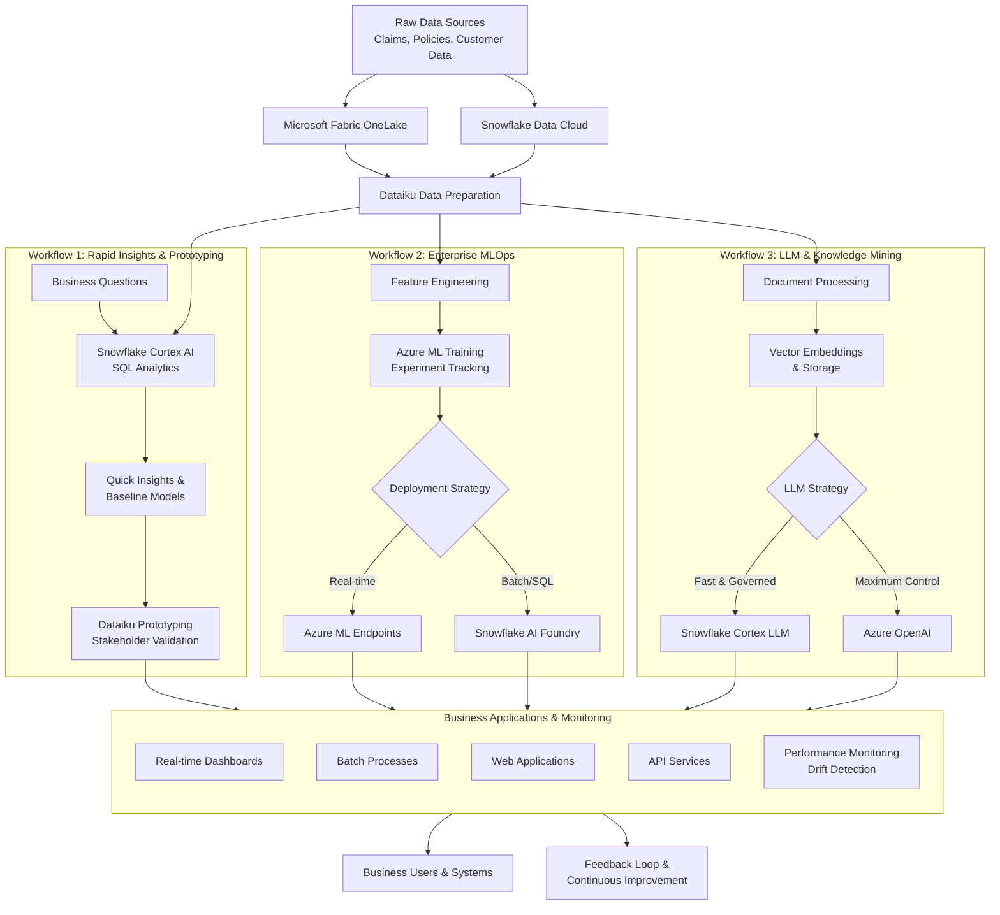
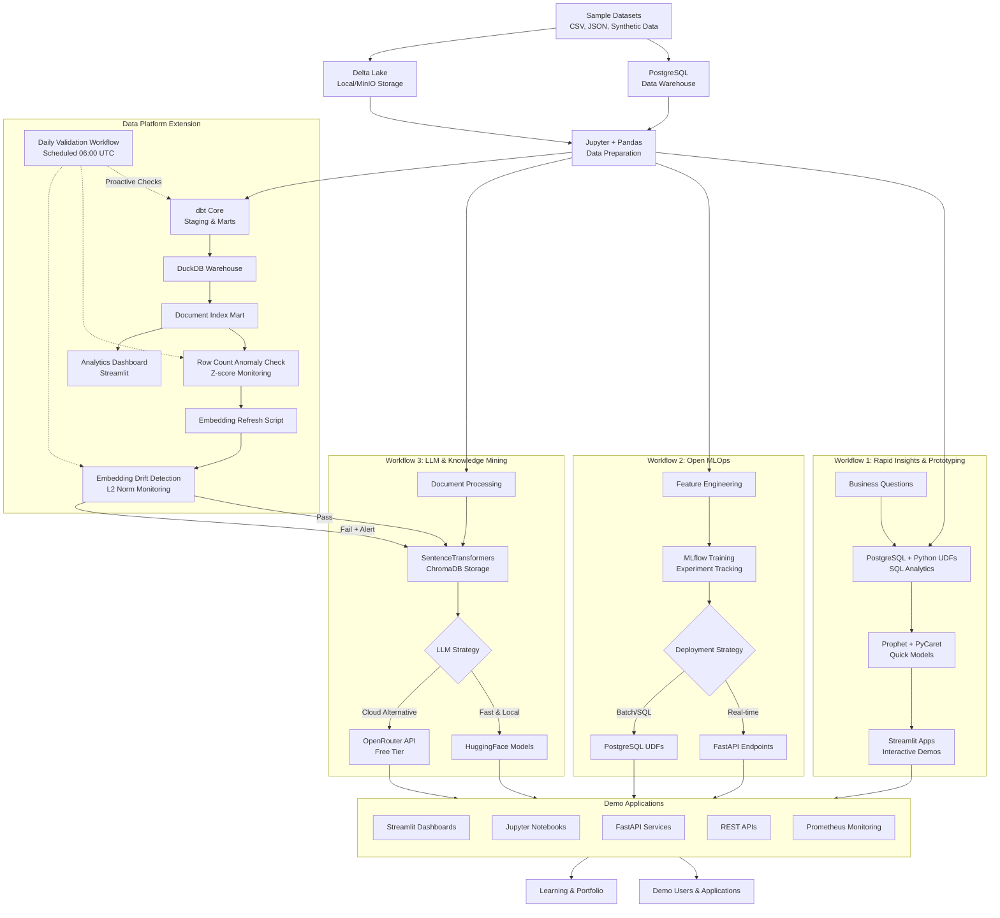

# Enterprise AI Workflows - Architecture Overview

This document compares the **enterprise-grade architecture** used in production environments versus our **open-source implementation** for learning and demonstration purposes.

## 📊 Quick Navigation

- **[ARCHITECTURE-ENTERPRISE.md](./ARCHITECTURE-ENTERPRISE.md)** - Beautiful diagram of enterprise tools (Azure ML, Snowflake, Dataiku, etc.)
- **[ARCHITECTURE-OPENSOURCE.md](./ARCHITECTURE-OPENSOURCE.md)** - Beautiful diagram of our open-source stack (MLflow, PostgreSQL, etc.)
- **This document** - Detailed workflow comparisons and technical deep-dive


## 🏢 Enterprise Architecture (Industry Standard)

This is what you'll see at Fortune 500 companies implementing modern AI/ML platforms:



### Enterprise Tools Used:

| Component | Technology | Purpose | Annual Cost (est.) |
|-----------|-----------|---------|-------------------|
| **Data Layer** | Microsoft Fabric + Snowflake | Unified data platform | $50K-500K+ |
| **Orchestration** | Dataiku | Collaborative AI platform | $100K-500K+ |
| **ML Training** | Azure ML | Enterprise MLOps | $20K-200K+ |
| **AI Services** | Snowflake Cortex + Azure OpenAI | AI capabilities | $10K-100K+ |
| **Monitoring** | Azure Monitor + Dataiku | Observability | $5K-50K+ |
| **Total** | | | **$185K-1.35M+/year** |

---

## 🚀 Our Open-Source Implementation

This repository demonstrates the **same architectural patterns** using free and open-source alternatives:



### Our Open-Source Stack:

| Component | Technology | Purpose | Cost |
|-----------|-----------|---------|------|
| **Data Layer** | PostgreSQL + Delta Lake | Local data platform | **$0** |
| **Orchestration** | Jupyter + Streamlit + Docker Compose | Workflow management | **$0** |
| **ML Training** | MLflow + PyCaret | Open MLOps | **$0** |
| **AI Services** | HuggingFace + SentenceTransformers | Local AI models | **$0** |
| **Monitoring** | Prometheus + Grafana | Observability | **$0** |
| **Deployment** | FastAPI + Docker | API serving | **$0** |
| **Data Modeling** | dbt Core + DuckDB | Curated semantic layer | **$0** |
| **Vector Store Persistence** | ChromaDB (PersistentClient) | Reusable embeddings | **$0** |
| **Analytics BI** | Streamlit Dashboard | Mart KPIs & corpus exploration | **$0** |
| **Reliability Monitoring** | Custom Python Scripts + GitHub Actions | Drift & anomaly detection | **$0** |
| **Total** | | | **$0** |

---

## 🎯 Key Architectural Patterns (Same in Both)

### 1. Separation of Concerns
- **Data Layer** - Centralized, governed storage
- **Compute Layer** - Scalable processing
- **Orchestration Layer** - Workflow management
- **Serving Layer** - Application delivery
- **Semantic Layer** - dbt-curated transformations enabling consistent downstream consumption (RAG + BI)
- **Embedding Layer** - Deterministic refresh pipeline linking marts to vector store

### 2. Fit-for-Purpose Tool Selection
- **Rapid prototyping** - SQL-based analytics
- **Production ML** - Full MLOps lifecycle
- **LLM applications** - Specialized AI services

### 3. Unified Orchestration
- Single interface for multiple workflows
- Consistent monitoring and governance
- Reproducible pipelines

### 4. Feedback Loops
- Continuous improvement
- Model retraining triggers
- Performance monitoring

### 5. Reliability & Safety Monitoring
- **Anomaly Detection** - Statistical checks (Z-score) on data volumes
- **Drift Detection** - Distribution monitoring on embeddings (L2 norm)
- **Proactive Validation** - Scheduled daily checks before issues reach production
- **Blocking Gates** - Pipeline fails on critical drift to prevent bad data propagation

---

## 📊 Feature Comparison

| Feature | Enterprise Stack | Our Implementation | Learning Value |
|---------|-----------------|-------------------|----------------|
| **Experiment Tracking** | Azure ML | MLflow | ✅ Same concepts |
| **SQL Analytics** | Snowflake Cortex | PostgreSQL + Python | ✅ Same patterns |
| **Model Deployment** | Azure ML Endpoints | FastAPI | ✅ Same REST API |
| **Orchestration** | Dataiku | Docker Compose + Jupyter | ✅ Same workflow logic |
| **Vector Search** | Snowflake + Cortex | ChromaDB + pgvector | ✅ Same embedding concepts |
| **Semantic Modeling** | dbt Cloud / Fabric | dbt Core + DuckDB | ✅ Same transformation lineage |
| **BI / Analytics** | Power BI / Tableau | Streamlit Dashboard | ✅ Same KPI surfacing |
| **LLM Integration** | Azure OpenAI | HuggingFace Transformers | ✅ Same prompt engineering |
| **Monitoring** | Azure Monitor | Prometheus + Grafana | ✅ Same metrics |
| **Drift Detection** | Azure ML Data Drift | Custom Z-score & L2 norm checks | ✅ Same statistical concepts |
| **Data Quality** | Monte Carlo / Soda | Great Expectations + custom scripts | ✅ Same anomaly detection patterns |
| **Data Governance** | Fabric + Snowflake | PostgreSQL + Git | ⚠️ Simplified but conceptually similar |

---

## 💡 Why This Implementation Approach?

### For Learning:
- ✅ **Zero cost** - No enterprise licenses needed
- ✅ **Full control** - Run everything locally
- ✅ **Transparent** - See all the "magic" under the hood
- ✅ **Transferable** - Concepts apply directly to enterprise tools
- ✅ **Composable** - Extend base architecture with semantic + vector + BI layers without rework

### For Portfolio:
- ✅ **Demonstrates understanding** of enterprise architecture
- ✅ **Shows practical skills** with industry-standard patterns
- ✅ **Proves ability to learn** and adapt to new tools
- ✅ **Provides working demos** for interviews

### For Interviews:
> *"While I built this using open-source tools, I designed it to mirror the architecture patterns used by Azure ML, Snowflake, and Dataiku. The core concepts—MLOps lifecycle, orchestration, governance—are identical. This shows I can quickly adapt to your enterprise stack because I understand the underlying principles, not just specific tool interfaces."*

---

## 🚀 Project Structure

This repository implements all three workflows:

```
enterprise-ai-workflows/
├── data-platform/                # dbt + DuckDB + embeddings refresh + analytics dashboard
│   ├── dbt/                      # Seeds, staging, marts, tests
│   ├── analytics_dashboard.py    # Streamlit BI over marts
│   └── README.md / README_DASHBOARD.md
├── project1-rag-application/      # Workflow 3: LLM & Knowledge Mining
├── project2-mlops-pipeline/       # Workflow 2: Enterprise MLOps
├── project3-rapid-insights/       # Workflow 1: Rapid Analytics (Coming Soon)
├── ARCHITECTURE.md               # This file
└── README.md                     # Getting started guide
```

---

## 📚 Learning Path

1. **Start with Project 2 (MLOps)** - Core ML lifecycle
2. **Move to Project 1 (RAG)** - Modern LLM applications
3. **Add Project 3 (Analytics)** - SQL-based insights
4. **Integrate Data Platform** - dbt transformations & semantic layer
5. **Connect RAG to dbt** - Embedding refresh from `document_index` mart
6. **Add BI Dashboard** - KPI & corpus exploration

Each project demonstrates different aspects of the enterprise architecture while using the same underlying patterns.

---

## 🎯 Enterprise Tools → Open Source Mapping

| Enterprise Tool | Open Source Alternative | Why It Works |
|----------------|------------------------|--------------|
| **Azure ML** | MLflow + Scikit-learn | Same experiment tracking, model registry, deployment patterns |
| **Snowflake Cortex** | PostgreSQL + Python UDFs | Same SQL interface, function-based AI |
| **Dataiku** | Jupyter + Streamlit + Docker Compose | Same collaborative workflows, visual apps |
| **Microsoft Fabric** | PostgreSQL + Delta Lake | Same unified data storage concept |
| **Snowflake AI Foundry** | ChromaDB + HuggingFace | Same model registry and inference patterns |
| **Azure OpenAI** | Open-source LLMs (Llama, Mistral) | Same prompting and API patterns |
| **dbt Cloud / Fabric Semantic Layer** | dbt Core + DuckDB | Same governed transformation & lineage |
| **Power BI / Tableau** | Streamlit Analytics Dashboard | Same KPI visualization & ad-hoc exploration |
| **Azure ML Data Drift** | Custom Python Scripts | Same statistical monitoring (Z-score, distribution checks) |
| **Monte Carlo / Soda Core** | Great Expectations + Custom Checks | Same anomaly detection and data quality gates |

---

## 🎤 Interview Discussion Points

When discussing this architecture:

1. **"I understand the business value of each component"**
   - Not just "I know MLflow" but "I know why companies choose managed ML platforms"

2. **"I can evaluate trade-offs between tools"**
   - When to use Snowflake Cortex vs custom Azure ML models
   - Cost vs control vs speed considerations

3. **"I've implemented the core patterns"**
   - Experiment tracking, model versioning, API deployment
   - Even if with different tools, the concepts transfer

4. **"I prioritize reliability and safety"**
   - Built-in drift detection and anomaly monitoring
   - Statistical gates prevent bad data from propagating
   - Proactive validation catches issues before users do
   - Demonstrates interpretability and safety mindset (aligned with Anthropic values)

5. **"I can learn new tools quickly"**
   - Proof: I built this architecture by understanding documentation
   - The patterns are more important than specific vendor syntax

---

## 🔗 Related Resources

- [Project 1: RAG Application](./project1-rag-application/README.md)
- [Project 2: MLOps Pipeline](./project2-mlops-pipeline/README.md)
- [Setup Notes: MLflow 3.6.0 Fixes](./project2-mlops-pipeline/SETUP_NOTES.md)
- [Data Platform README](./data-platform/README.md)
- [Analytics Dashboard](./data-platform/README_DASHBOARD.md)
- [Embedding Refresh Script](./scripts/refresh_embeddings.py)
- [Data Lineage Diagram](./docs/data-lineage.md)
- [Metrics Catalog](./METRICS.md)
- [Data SLA Documentation](./DATA_SLA.md)
- [Drift Detection Script](./scripts/check_embedding_drift.py)
- [Anomaly Detection Script](./scripts/check_row_count_anomaly.py)

---

**Built to demonstrate enterprise AI architecture patterns using open-source tools** 🚀

*Last updated: November 22, 2025*
