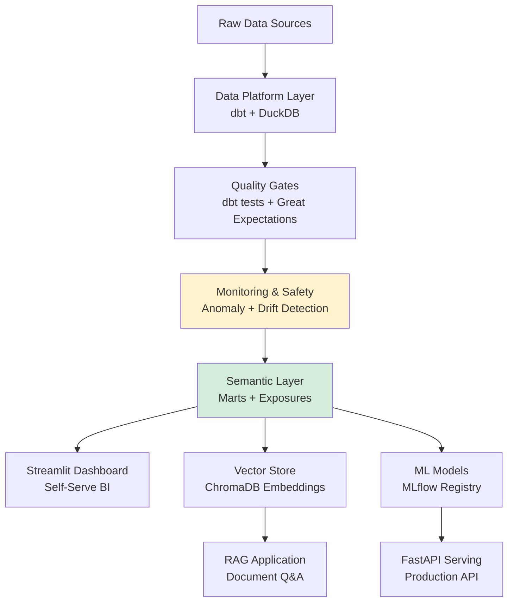

# 🚀 Enterprise AI Workflows - Free Implementation Guide

> Learn enterprise AI/ML workflows using **100% free and open-source tools**. Perfect for building your portfolio and demonstrating production-ready skills!

## 🌐 Live Demo Links

### Project 1: Rapid Insights Dashboard
**🔗 [Live App](https://enterprise-ai-workflows-d3ds3rasntycg5bwaqru5a.streamlit.app)**
- **What it does:** Interactive Streamlit dashboard for SQL-based analytics with AI-powered insights
- **Key features:** Time-series forecasting with Prophet, sentiment analysis, SQL query interface
- **Tech stack:** Streamlit, SQLite, PyCaret, Prophet, Plotly
- **Use case:** Rapid prototyping and business intelligence for stakeholders

### Project 2: MLOps Pipeline (Customer Churn Prediction)
**🔗 [MLflow UI](https://zhangju2023-mlops-pipeline-demo.hf.space/mlflow/)** | **🔗 [API Docs](https://zhangju2023-mlops-pipeline-demo.hf.space/api/docs)** | **🔗 [API Health](https://zhangju2023-mlops-pipeline-demo.hf.space/api/health)** | **🔗 [Example Prediction](https://zhangju2023-mlops-pipeline-demo.hf.space/api/predict/example)**
- **What it does:** Complete ML lifecycle from experimentation to production API deployment
- **Key features:** Experiment tracking, model registry, versioning, REST API with <200ms latency
- **Tech stack:** MLflow, FastAPI, PostgreSQL, Docker, scikit-learn
- **Use case:** Production-grade ML model serving with full observability

### Project 3: Document Q&A (RAG Application)
**🔗 [Live App](https://huggingface.co/spaces/zhangju2023/document-qa-rag)**
- **What it does:** RAG-powered document intelligence for semantic search and compliance Q&A
- **Key features:** ChromaDB vector store, persistent embeddings, HuggingFace transformers
- **Tech stack:** LangChain, ChromaDB, SentenceTransformers, Gradio
- **Use case:** Knowledge mining, policy document search, automated compliance assistance

### Project 4: Data Platform & Analytics Dashboard
**📊 Run locally** (see [Quick Start](#-quick-start))
- **What it does:** dbt-powered data modeling layer feeding both RAG and BI applications
- **Key features:** 7 dbt models, 23 tests, drift detection, anomaly monitoring, data lineage
- **Tech stack:** dbt Core, DuckDB, Streamlit, Great Expectations, GitHub Actions
- **Use case:** Self-serve analytics with reliability and quality governance

---

## 📋 Overview

This repository contains three production-ready projects that demonstrate enterprise AI/ML workflows without expensive licenses:

1. **Rapid Insights Workflow** - SQL-based analytics with AI capabilities
2. **Enterprise MLOps Pipeline** - Complete ML lifecycle management
3. **Document Q&A System** - RAG-based LLM application
4. **Data Platform & Analytics** - dbt-powered curated corpus + Streamlit dashboard feeding RAG & BI layers

## 🎯 What You'll Learn

- **MLOps Best Practices** - Experiment tracking, model registry, deployment
- **Data Analytics** - SQL, Python, real-time dashboards
- **Data Modeling & Quality** - dbt transformations, Great Expectations validation
- **LLM Applications** - RAG pipelines, vector databases, embeddings
- **Workflow Orchestration** - Airflow DAGs, quality gates, backfills
- **Cloud Architecture** - Scalable, production-ready patterns
- **DevOps** - Docker, CI/CD, containerization
- **Reliability & Safety** - Drift detection, anomaly monitoring, data lineage
- **Self-Serve Analytics** - Semantic modeling, metrics catalogs, exposures

## 🏗️ Architecture Overview

This portfolio demonstrates **enterprise AI/ML architecture patterns** using open-source tools that mirror industry-standard solutions:



**🔗 See Full Architecture Documentation:** [ARCHITECTURE.md](./ARCHITECTURE.md)

### Key Architectural Patterns Demonstrated:

| Pattern | Enterprise Tool | Open-Source Implementation | Status |
|---------|----------------|---------------------------|--------|
| **Semantic Data Modeling** | dbt Cloud / Fabric | dbt Core + DuckDB | ✅ |
| **Data Quality Gates** | Monte Carlo / Soda | Great Expectations + Custom checks | ✅ |
| **Drift Detection** | Azure ML Data Drift | Custom Z-score & L2 norm checks | ✅ |
| **Self-Serve Analytics** | Power BI / Tableau | Streamlit + dbt Exposures | ✅ |
| **ML Experiment Tracking** | Azure ML | MLflow + PostgreSQL | ✅ |
| **Model Deployment** | Azure ML Endpoints | FastAPI + Docker | ✅ |
| **Vector Search** | Snowflake Cortex | ChromaDB + SentenceTransformers | ✅ |
| **Workflow Orchestration** | Azure Data Factory | Airflow + GitHub Actions | ✅ |

**💡 Value Proposition:** Learn industry-standard architectural patterns using $0 tools that translate directly to enterprise environments.

---

## 🗂️ Project Structure

```
enterprise-ai-workflows/
├── project1-rapid-insights/        # Snowflake Cortex alternative
│   ├── app.py                      # Streamlit dashboard
│   ├── database.py                 # SQLite with AI functions
│   └── requirements.txt
│
├── project2-mlops-pipeline/        # Azure ML alternative
│   ├── docker-compose.yml          # MLflow + Jupyter + PostgreSQL
│   ├── notebooks/                  # Experiment notebooks
│   ├── models/                     # Model training scripts
│   └── deployment/                 # FastAPI deployment
│
├── project3-document-qa/           # LLM RAG application
│   ├── app.py                      # Gradio interface
│   ├── rag_pipeline.py             # Vector search + LLM
│   └── requirements.txt
│
├── data-platform/                  # Data modeling + analytics
│   ├── dbt/                        # dbt project (seeds, staging, marts)
│   ├── analytics_dashboard.py      # Streamlit BI dashboard
│   └── README.md
│
├── great_expectations/             # Data quality validation
│   ├── expectations/               # Expectation suites
│   ├── checkpoints/                # Validation checkpoints
│   └── README.md
│
├── airflow/                        # Optional orchestration layer
│   ├── dags/                       # DAG definitions
│   └── README.md
│
└── docs/                           # Additional documentation
    ├── setup-guide.md
    ├── interview-prep.md
    └── architecture-decisions.md
```

## 🚀 Quick Start

### Prerequisites
- Python 3.8+ installed
- Docker Desktop (for Project 2)
- 5GB free disk space

### Installation

```bash
# Clone and enter the directory
cd enterprise-ai-workflows

# Set up virtual environment
python3 -m venv venv
source venv/bin/activate  # On macOS/Linux
# venv\Scripts\activate  # On Windows

# Install dependencies for a specific project
cd project1-rapid-insights
pip install -r requirements.txt
```

### End-to-End (Data → Embeddings → RAG → Analytics)

```bash
# Build curated data (dbt transformations)
cd data-platform/dbt
dbt seed && dbt run && dbt test

# Refresh vector store from document_index mart
cd ../../
python scripts/refresh_embeddings.py --persist-dir project3-document-qa/chroma_store --reset

# Launch RAG application (consumes persistent Chroma store if present)
cd project3-document-qa
python app.py  # http://localhost:7860

# Launch analytics dashboard (BI view on marts)
cd ../data-platform
streamlit run analytics_dashboard.py  # http://localhost:8502
```

### One-Command Full Pipeline (dbt + Quality Gates + Embeddings)
Instead of running each step manually, you can execute the entire data & AI preparation workflow with a single script that:

1. Seeds and builds dbt models (staging + marts)
2. Runs all dbt tests (structural quality)
3. Performs semantic data quality checks (row count, schema, uniqueness, text length bounds)
4. Refreshes the Chroma vector store from the curated `document_index` mart
5. Verifies the vector store document count

Run from the repo root:
```bash
./scripts/run_full_pipeline.sh
```

Prerequisites (first time only):
```bash
pip install dbt-core dbt-duckdb great-expectations chromadb sentence-transformers streamlit
```

Sample output (abridged):
```
📥 STEP 1: dbt seed            ✅ Seeds loaded
🏗️  STEP 2: dbt run             ✅ 6 models built
🧪 STEP 3: dbt test            ✅ 18 tests passed
🔍 STEP 4: Quality Gate        ✅ All semantic checks passed
🧬 STEP 5: Refresh Embeddings  ✅ 21 embeddings stored
✔️  STEP 6: Verify Vector Store ✅ 21 documents
🎉 PIPELINE COMPLETE!
```

Artifacts produced:
- DuckDB warehouse: `data-platform/dbt/warehouse/data.duckdb`
- Persistent vector store: `project3-document-qa/chroma_store/`
- dbt docs site (build): `data-platform/dbt/target/index.html`

Use this script to demonstrate "end-to-end workflow orchestration with embedded quality gates" (even without Airflow).

Artifacts produced:
- DuckDB warehouse: `data-platform/dbt/warehouse/data.duckdb`
- Vector store: `project3-document-qa/chroma_store/` (persistent embeddings)
- Dashboard app: `data-platform/analytics_dashboard.py`

## 📊 Project Details

### Project 1: Rapid Insights Workflow
**Simulates:** Snowflake Cortex AI  
**Tech Stack:** Python, SQLite, Streamlit, TextBlob, NumPy  
**Features:**
- 📊 **Advanced Time Series Forecasting**: Intelligent trend detection with recent-window slope calculation and automatic seasonal pattern recognition
- 💬 **SQL-based Sentiment Analysis**: TextBlob integration via SQLite UDFs
- 📝 **Text Summarization**: Extractive summarization accessible through SQL
- 🧑‍💼 **HR & Payroll Analytics**: Sample datasets with payroll forecasting, employee tenure tracking, and overtime detection
- 🎨 **Interactive Dashboard**: Real-time visualizations with Plotly

**Run it:**
```bash
cd project1-rapid-insights
streamlit run app.py
```

**Key Innovations:**
- Momentum-based forecasting for trending data (captures recent patterns)
- Naive seasonal forecasting for cyclical data (repeats patterns intelligently)
- Smart cache management with version markers for seamless updates

### Project 2: Enterprise MLOps Pipeline
**Simulates:** Azure ML, Dataiku  
**Tech Stack:** MLflow, Docker, PostgreSQL, FastAPI, Scikit-learn  
**Features:**
- Experiment tracking
- Model registry
- Automated retraining
- REST API deployment
- CI/CD pipeline

**Run it:**
```bash
cd project2-mlops-pipeline
docker-compose up -d
# Access MLflow at http://localhost:5000
# Access Jupyter at http://localhost:8888
```

**Deployment Options:**
- See [Live Demo Links](#-live-demo-links) section above for persistent Hugging Face Space deployment
- Use GitHub Codespaces for temporary testing environment (URLs provided after launch)
     https://codespaces.new/justin-mbca/enterprise-ai-workflows?quickstart=1
### Project 3: Document Q&A System

[](https://huggingface.co/spaces/zhangju2023/document-qa-rag)

**Simulates:** Azure OpenAI RAG  
**Tech Stack:** ChromaDB, SentenceTransformers, Hugging Face Transformers  
**Features:**
- Document ingestion
- Vector embeddings
- Semantic search
- Question answering
- Web interface

**Run it:**
```bash
cd project3-document-qa
python app.py
# Access at http://localhost:7860
```

Live app: https://huggingface.co/spaces/zhangju2023/document-qa-rag

#### Integrated Data Platform Features
- Curated `document_index` mart (dbt) unifies HR, legal (arbitration & subrogation), and ML concept texts.
- Embedding refresh script (`scripts/refresh_embeddings.py`) builds a persistent Chroma store from dbt output.
- RAG app auto-detects persistent store and skips sample preload for production-like behavior.
- Analytics dashboard (`data-platform/analytics_dashboard.py`) visualizes mart KPIs (policy features, arbitration deadlines, document distribution).

#### Embedding Refresh Workflow
```bash
cd data-platform/dbt
dbt seed && dbt run
cd ../../
python scripts/refresh_embeddings.py --persist-dir project3-document-qa/chroma_store --reset
```
Then start the app:
```bash
cd project3-document-qa
export CHROMA_PERSIST_DIR="project3-document-qa/chroma_store"  # optional
python app.py
```

#### Analytics Dashboard
```bash
cd data-platform
streamlit run analytics_dashboard.py
```
Tabs: Overview, HR Policies, Arbitration Timelines, Document Index (export CSV/JSON).

## 💰 Cost Breakdown

| Component | Enterprise Tool | Free Alternative | Savings |
|-----------|----------------|------------------|---------|
| Data Warehouse | Snowflake ($2000+/year) | PostgreSQL + SQLite | $2000+ |
| MLOps Platform | Azure ML ($1000+/year) | MLflow + Docker | $1000+ |
| Low-code ML | Dataiku ($50k+/year) | Jupyter + Streamlit | $50k+ |
| LLM API | Azure OpenAI ($100+/month) | Open models (local) | $1200+ |
| Data Modeling | Commercial Data Platforms ($1000+) | dbt Core + DuckDB | $1000+ |
| **Total** | **$54,200+/year** | **$0** | **$54,200+** |

## 🎯 Key Technical Highlights

### How to Discuss These Projects

**For Tool-Specific Questions:**
> "I implemented this using MLflow to master MLOps fundamentals—the concepts of experiment tracking, model versioning, and deployment pipelines transfer directly to Azure ML. I can adapt quickly to your tech stack."

**For Architecture Questions:**
> "I designed this to mirror production patterns: separate data layer, orchestration layer, and serving layer. Here's how I handled [specific challenge]..."

**For Problem-Solving Questions:**
> "When building my RAG pipeline, I optimized vector search performance by [specific solution]. This taught me [learning outcome]."

##  Free Resources Used

- **Datasets:** Kaggle, UCI ML Repository
- **Models:** Hugging Face Hub
- **Hosting:** Streamlit Cloud, Railway.app, Render
- **Compute:** Google Colab, Kaggle Notebooks
- **Version Control:** GitHub (free tier)

## �️ Implementation Phases

### ✅ Phase 1 Reliability Foundations (Completed)
Phase 1 established baseline governance and transparency artifacts:

- `METRICS.md` – Canonical metric catalog with formulas + SLA targets.
- `DATA_SLA.md` – Schedule, quality gates, alerting & recovery procedures.
- `docs/data-lineage.md` – Mermaid lineage from seeds → staging → marts → quality gates → embeddings → serving.
- Enriched `data-platform/dbt/models/schema.yml` – Column-level descriptions + domain enumerations.

These artifacts position the project as an analytics engineering portfolio piece (showing modeling, documentation, observability, and reliability mindset).

### ✅ Phase 2 Self-Serve Analytics & Scalability (Completed)
Phase 2 introduced patterns for self-serve insights and data scalability:

- `data-platform/dbt/models/exposures.yml` – 4 exposures linking marts to downstream consumers (dashboards, RAG app, reports) with ownership metadata.
- `data-platform/dbt/models/sources.yml` – Source definitions with freshness configuration template (commented for seed-based sources; ready for production ingestion).
- `data-platform/dbt/models/marts/events_incremental.sql` – Incremental model demonstrating `is_incremental()` logic, unique key constraint, and timestamp-based filtering for scalability.
- Added schema docs for `events_incremental` model with 8 column definitions.

**Key technical highlights:**
- Exposures = metrics observability + lineage to BI/apps (enables transparency and governance).
- Incremental models = cost-efficient processing at scale for large data volumes.
- Source freshness = SLA enforcement (catches stale ingestion early).

Validated: dbt compile/run/test all pass (23 tests green, 7 models including 1 incremental).

### ✅ Phase 3 Reliability & Safety Monitoring (Completed)
Phase 3 adds interpretability and reliability features for production-grade data platforms:

- `scripts/check_embedding_drift.py` – Detects distribution shifts in embedding L2 norms (mean ±10% threshold) vs historical baseline; exits non-zero to gate pipeline.
- `scripts/check_row_count_anomaly.py` – Z-score anomaly detection (threshold=3σ) on mart row counts using 7-day rolling window; flags unexpected spikes/drops.
- Updated `scripts/run_full_pipeline.sh` – Integrated Steps 5 (anomaly check) and 7 (drift check) with Slack failure detail via `--failures-file` flag.
- `.github/workflows/daily-validation.yml` – Scheduled daily workflow (06:00 UTC) running dbt tests + drift + anomaly checks; posts Slack summary; collects metrics snapshots as artifacts.
- Baseline files created: `metrics/baselines/embedding_norm.json`, `metrics/baselines/row_counts.json`.

**Why this matters:**
- **Reliability:** Automated detection of data quality regressions and model drift before they reach production.
- **Interpretability:** Explicit baselines and statistical thresholds (Z-score, L2 norm) make decisions auditable.
- **Safety:** Drift detection acts as a kill switch—prevents deploying embeddings with unexpected distributions that could degrade RAG quality.

**Key technical highlights:**
- Drift detection = model governance (catches encoder updates, input degradation).
- Anomaly detection = data SLA monitoring (row count stability ensures completeness).
- Daily validation workflow = proactive health checks (shift-left observability).
- Slack integration with `--failures-file` = actionable incident response (enumerate root causes).

Validated: drift/anomaly scripts run successfully; baselines initialized; pipeline integration tested.

### 🔔 Alerts (CI + Data Quality)
This repo includes Slack alert integration at two layers:

- **CI Pipeline (GitHub Actions)**: `.github/workflows/full-pipeline.yml` posts a message on success or failure after running the end-to-end script.
- **Data Quality Gate (Semantic / GE)**: `scripts/run_full_pipeline.sh` sends a Slack alert if the semantic validation (Great Expectations + manual checks) fails before embedding refresh.

Setup:
1. Create an Incoming Webhook in your Slack workspace.
2. Add the webhook URL as a GitHub repository secret named `SLACK_WEBHOOK_URL` (Settings → Secrets and variables → Actions).
3. (Optional) For local testing, export the variable before running the script:
  ```bash
  export SLACK_WEBHOOK_URL="https://hooks.slack.com/services/XXX/YYY/ZZZ"
  ./scripts/run_full_pipeline.sh
  ```

Alert script: `scripts/slack_notify.py` (emoji prefixes for success, failure, warning).
Extended alert script capabilities:

```bash
# Basic message (auto info emoji)
python3 scripts/slack_notify.py "Pipeline run complete"

# Explicit level
python3 scripts/slack_notify.py "dbt models built" --level success
python3 scripts/slack_notify.py "Quality gate failed" --level error

# Append failing expectations from a JSON or text file
python3 scripts/slack_notify.py "Quality gate failed" --level error --failures-file great_expectations/uncommitted/validations/latest.json

# Send a fully custom JSON payload (overrides other flags)
python3 scripts/slack_notify.py "placeholder" --raw-json payload.json

# Plain message without emoji
python3 scripts/slack_notify.py "Quiet notification" --no-emoji
```

Failure details file format examples handled by `--failures-file`:
- JSON list: `["row count mismatch","unexpected domain: finance"]`
- JSON object with `failures` key: `{ "failures": ["duplicate IDs", "text length spike"] }`
- Plain text file: one failure per line.

If the file has >15 lines it is truncated with a summary line.

Emoji got garbled? If you see characters like `ÿ...e2...9d...8c`, your terminal encoding or copy source mangled the UTF-8 emoji. Paste directly from a UTF-8 source or use ASCII text; the script inserts standard Slack emoji codes automatically for the `--level` values.

To extend alerts further (e.g., suppress success spam, include GE expectation statistics), add a step that writes a small JSON file of failures and pass its path via `--failures-file`.

### Data Platform & Quality Layer
This repo now includes **Great Expectations** for formal data quality validation:
- **Suite:** `great_expectations/expectations/document_index_suite.json` validates row counts, schema, domain values, text length bounds, and source lineage.
- **Checkpoint:** `great_expectations/checkpoints/document_index_checkpoint.yml` runs the suite against the `document_index` mart (DuckDB).
- **Airflow Integration:** `ge_document_index_validation` task gates embedding refresh—only proceeds if quality checks pass.
- **CI:** GitHub Actions workflow executes GE checkpoint before building vector store.

**Why this matters:**
- Prevents semantic drift (e.g., unexpected domain "finance" stops embeddings).
- Demonstrates shift-left testing + SLA enforcement.
- Shows understanding of governance beyond structural dbt tests.

**Run GE checkpoint locally:**
```bash
cd great_expectations
REPO_ROOT=$(pwd)/.. great_expectations checkpoint run document_index_checkpoint
```

### Data Platform Next Steps (Optional)
- Add dbt metrics + semantic layer for standardized KPIs.
- Expand GE with statistical distribution checks (e.g., detect sudden text length shifts).
- Schedule embedding refresh via GitHub Actions to auto-sync RAG corpus.
- Add Lightdash/Evidence for richer BI exploration.

## 🛠 Airflow Orchestration Layer

This portfolio implements Apache Airflow orchestration to demonstrate production-grade workflow management for multi-step data and AI pipelines.

**DAG:** `airflow/dags/data_platform_pipeline.py`

**Pipeline Steps:**
1. `dbt_seed` – Load seed CSVs into DuckDB
2. `dbt_run` – Build staging + marts (including `document_index`)
3. `dbt_test` – Enforce data quality (relationships, not_null, accepted_values)
4. `refresh_embeddings` – Rebuild persistent Chroma store from curated mart
5. `doc_vector_count_check` – Assert vector count matches document count

**Key Technical Highlights:**
- **Workflow Orchestration:** 6-step DAG with explicit dependencies and quality gates
- **Data Quality Integration:** Great Expectations validation gates embedding refresh
- **Scheduled Execution:** Daily runs at 05:00 UTC with configurable SLAs
- **Production Patterns:** Retry logic, configurable paths, artifact validation
- **CI/CD Integration:** GitHub Actions workflow validates DAG on every push

**Quick Local Demo:**
```bash
export AIRFLOW_HOME="$(pwd)/airflow"
python -m venv venv && source venv/bin/activate

# 🚀 Enterprise AI Workflows - Free Implementation Guide

> Learn enterprise AI/ML workflows using **100% free and open-source tools**. Build your portfolio and demonstrate production-ready skills!

---

## 📑 Table of Contents

1. [Live Demos & Projects](#live-demos--projects)
2. [Quick Start](#quick-start)
3. [Project Summaries](#project-summaries)
4. [Architecture Overview](#architecture-overview)
5. [What You'll Learn](#what-youll-learn)
6. [Project Structure](#project-structure)
7. [Further Reading](#further-reading)

---

## 🌐 Live Demos & Projects

- **Project 1: Rapid Insights Dashboard** ([Live App](https://enterprise-ai-workflows-d3ds3rasntycg5bwaqru5a.streamlit.app))
- **Project 2: MLOps Pipeline** ([MLflow UI](https://zhangju2023-mlops-pipeline-demo.hf.space/mlflow/), [API Docs](https://zhangju2023-mlops-pipeline-demo.hf.space/api/docs))
- **Project 3: Document Q&A (RAG)** ([Live App](https://huggingface.co/spaces/zhangju2023/document-qa-rag))
- **Project 4: Data Platform & Analytics Dashboard** (Run locally)

---

## ⚡ Quick Start

Clone the repo and launch any project:

```bash
git clone https://github.com/justin-mbca/enterprise-ai-workflows.git
cd enterprise-ai-workflows
# See each project folder for setup instructions
```

---

## 📦 Project Summaries

| Project | Description | Tech Stack | Learn More |
|---------|-------------|------------|------------|
| **Rapid Insights** | Streamlit dashboard for SQL analytics, forecasting, sentiment, prompt engineering, annotation, RLHF | Streamlit, SQLite, Prophet, Plotly | [project1-rapid-insights/README.md](project1-rapid-insights/README.md) |
| **MLOps Pipeline** | End-to-end ML lifecycle: training, tracking, registry, FastAPI serving, CI/CD | MLflow, FastAPI, Docker, scikit-learn | [project2-mlops-pipeline/README.md](project2-mlops-pipeline/README.md) |
| **Document Q&A (RAG)** | RAG-powered semantic search and Q&A over documents | LangChain, ChromaDB, Gradio | [project3-document-qa/README.md](project3-document-qa/README.md) |
| **Data Platform & Analytics** | dbt-powered data modeling, tests, drift/anomaly detection, BI dashboard | dbt, DuckDB, Streamlit, Great Expectations | [data-platform/README.md](data-platform/README.md) |

---

## �️ Architecture Overview

<details>
<summary>Click to expand architecture diagram</summary>


</details>

See [ARCHITECTURE.md](./ARCHITECTURE.md) for full details, patterns, and implementation status.

---

## 🎯 What You'll Learn

- MLOps best practices (tracking, registry, deployment)
- Data analytics (SQL, Python, dashboards)
- Data modeling & quality (dbt, Great Expectations)
- LLM applications (RAG, embeddings, vector DBs)
- Orchestration (Airflow, quality gates)
- DevOps (Docker, CI/CD)
- Reliability & safety (drift, anomaly, lineage)
- Self-serve analytics (semantic modeling, exposures)

---

## 🗂️ Project Structure

```text
enterprise-ai-workflows/
├── project1-rapid-insights/
├── project2-mlops-pipeline/
├── project3-document-qa/
├── data-platform/
├── docs/
├── scripts/
├── great_expectations/
├── gx/
├── metrics/
```

---

## 📚 Further Reading

- [ARCHITECTURE.md](ARCHITECTURE.md) - Full architecture, patterns, and implementation table
- [DATA_SLA.md](DATA_SLA.md) - Data pipeline SLAs
- [METRICS.md](METRICS.md) - Canonical metrics
- [docs/data-lineage.md](docs/data-lineage.md) - Data lineage diagram
- [data-platform/dbt/README.md](data-platform/README.md) - Data platform details

---

For detailed project usage, see each project's README in its folder.
