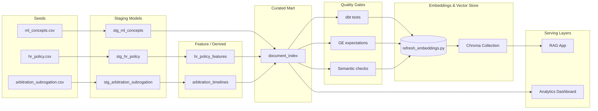

# Data Lineage

High-level lineage from raw seed files to serving layers (analytics dashboard & RAG application).

## Notes
- All transformations executed via dbt; tests applied post-build.
- Great Expectations and semantic checks gate the embedding refresh.
- Chroma persistent store consumed directly by RAG application; dashboard queries DuckDB marts.
- Future: add drift & anomaly checks between Quality Gates and Embedding step.
