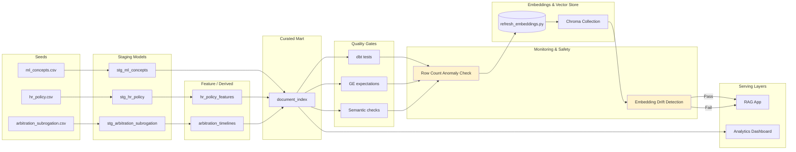

# Data Lineage

High-level lineage from raw seed files to serving layers (analytics dashboard & RAG application).

## Notes
- All transformations executed via dbt; tests applied post-build.
- Great Expectations and semantic checks gate the embedding refresh.
- **Row Count Anomaly Check**: Statistical monitoring (Z-score) detects unexpected volume changes in marts before embeddings.
- **Embedding Drift Detection**: Monitors L2 norm distribution post-embedding to catch model/input quality degradation; blocks pipeline on drift.
- Chroma persistent store consumed directly by RAG application; dashboard queries DuckDB marts.
- Daily validation workflow (06:00 UTC) runs full test suite + monitoring checks proactively.
